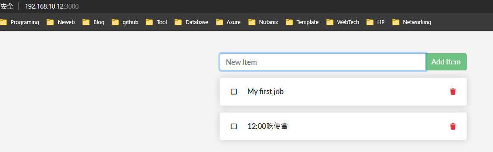

<h1 align=center>應用程式容器化</h1>

<h3>準備事項</h3>

  * 備好你要容器化的程式碼。
  * 開發環境如: git、IDE。
  * docker環境如: Docker Desktop、Docker Engine。

  <h3>開始</h3>

先從官網下載範例程式碼:
```shell
 git clone https://github.com/docker/getting-started-app.git
``` 
該範例的目錄結構如下:
```shell
├── getting-started-app/
│ ├── package.json
│ ├── README.md
│ ├── spec/
│ ├── src/
│ └── yarn.lock
```
建置App的Image，通常我們會使用Dockerfile，這是一種文字模式的script，寫好後Docker會依照裡面的script內容來建置你的image。
首先，切換到剛下載下來的目錄裡:
```shell
$ cd /path/to/getting-started-app
```
建立一個Dockerfile
```shell
$ touch Dockerfile
```
編輯Dockerfile的內容:
```shell
# syntax=docker/dockerfile:1

FROM node:18-alpine
WORKDIR /app
COPY . .
RUN yarn install --production
CMD ["node", "src/index.js"]
EXPOSE 3000
```
使用下列指令來建置image
```shell
$ cd /path/to/getting-started-app
$ sudo docker build -t getting-started .
[+] Building 36.7s (11/11) FINISHED                                                                          docker:default
 => [internal] load build definition from Dockerfile                                                                   0.0s
 => => transferring dockerfile: 182B                                                                                   0.0s
 => resolve image config for docker.io/docker/dockerfile:1                                                             3.1s
 => docker-image://docker.io/docker/dockerfile:1@sha256:ac85f380a63b13dfcefa89046420e1781752bab202122f8f50032edf31be0  1.8s
 => => resolve docker.io/docker/dockerfile:1@sha256:ac85f380a63b13dfcefa89046420e1781752bab202122f8f50032edf31be0021   0.0s
 => => sha256:ac85f380a63b13dfcefa89046420e1781752bab202122f8f50032edf31be0021 8.40kB / 8.40kB                         0.0s
 => => sha256:657fcc512c7369f4cb3d94ea329150f8daf626bc838b1a1e81f1834c73ecc77e 482B / 482B                             0.0s
 => => sha256:a17ee7fff8f5e97b974f5b48f51647d2cf28d543f2aa6c11aaa0ea431b44bb89 1.27kB / 1.27kB                         0.0s
 => => sha256:9d9c93f4b00be908ab694a4df732570bced3b8a96b7515d70ff93402179ad232 11.80MB / 11.80MB                       1.4s
 => => extracting sha256:9d9c93f4b00be908ab694a4df732570bced3b8a96b7515d70ff93402179ad232                              0.4s
 => [internal] load metadata for docker.io/library/node:18-alpine                                                      2.5s
 => [internal] load .dockerignore                                                                                      0.0s
 => => transferring context: 2B                                                                                        0.0s
 => [1/4] FROM docker.io/library/node:18-alpine@sha256:c7620fdecfefb96813da62519897808775230386f4c8482e972e37b8b18cb4  7.8s
 .........................................................................................................................
 .................................................
```
當開始建置時你可以看到有許多的下載，這是在你的Dockerfile裡一開始，會從【FROM node:18-alpine】中找尋node:18-alpine這個image，在本機裡找不到就會到網路上下載，有了基底的image就開始將你的程式複製進去，並使用yarn來安裝你的相依套件，在CMD聲明中，指定要執行那個指令當啟動container時，最後-t這個參數做一個可讀性的tag，以便運行時可供你識別，而docker build後那個 . 是代表在當前目錄下去找到Dockerfile。

使用下列指令來啟動Container:
```shell
$ sudo docker run -dp 127.0.0.1:3000:3000 getting-started
# -d or --detach表示container在背景執行
# -p or --publish建立主機與container之間的port mapping，如上指令中container的port 3000對到host的127.0.0.1:3000

$ sudo docker ps
#查看docker行程狀態
```
此時點開網頁應可以看到你的應用程式正式運行了:


<h4 align=center>First application</h4>