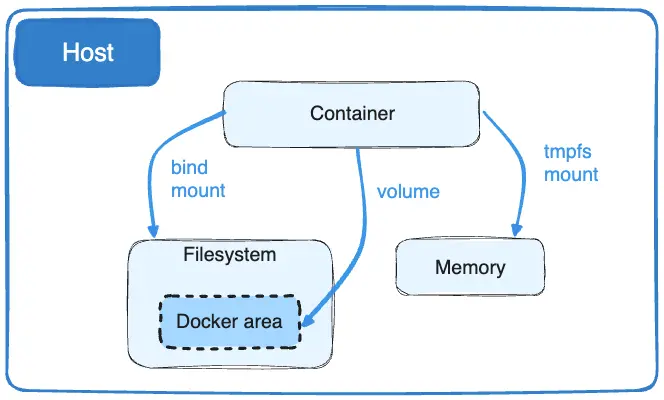

 <h3 align=center>Docker Volume</h3>

由於Docker容器是唯讀屬性，因此如果要將存放的資料持久化，需要從主機綁定一個空間供容器使用，[Bind mounts](https://docs.docker.com/storage/bind-mounts/)是從早期Docker就已存在了，與volume相比，功能有限，而它會存放在Docker的storage目錄之下，並受到Docker的管控。

另外，volume也有相較於Bind mounts這些優點:

* Volume比Bind mounts更容易備份或遷移。
* 你可以使用 Docker CLI 命令或 Docker API 管理volume。
* volume適用於Linux和 Windows 容器。
* volume可以更安全地在多個容器之間共用。
* 通過volume driver，您可以將volume存儲在遠端主機或雲供應商上，加密volume的內容或添加其他功能。
* 新volume的內容可以由容器預先填充。
* Docker Desktop 上的卷比從Mac 和 Windows 主機的Bind mounts性能要高得多 。

此外，將資料存放在volume比存放在容器的可寫層是較好的選擇，因為容器使用它不會增加額外的空間大小，並且volume的內容是獨立於容器的生命週期之外的。


<h4 align=center>Docker Volmue</h4>

如果你的資料沒有持久化的需求，可以考慮用tmpfs mount方式，也可以獲得比存放在容器可寫層較高的性能。

<h4>使用-v 或 --mount flag</h4>

一般來說，--mount是較為精準、冗長，與-v最大的不同是，-v將所有選項全放在一行上，而使用--mount則可分開各別的選項。

假如你要指定volume driver選項，那你需要使用--mount。

* -v 或 --volume: 由三個欄位組成，以分號(:)隔開，並且欄位順序不可錯。

  1. 第一個欄位為volume的名稱，並且是在該主機上唯一名稱。
  2. 第二個欄位為掛載到容器的目錄或檔案路徑。
  3. 第三個欄位為選項，是一個以逗號(,)隔開的選項清單。

* --mount: 由key-value pairs組成，以\<key>=\<value>組合和逗號隔開。

  1. mount的type，可以是bind、volume、tmpfs，本章節是以volume為主。
  2. mount的source，對於volume，這是volume的名稱，對於anonymous volumes，這是可省略的欄位，可以用source或src。
  3. destination則是指定所以掛載到容器的檔案或目錄路徑，可以是destination、dst或target。
  4. readonly選項，會讓綁定掛載的容器只能唯讀，可以是readonly或ro。
  5. volume-opt可以多次指定，使用key-value pairs組成。

  <h4>建立和管理volumes</h4>

  建立volume
  ```shell
  $ docker volume create my-vol
  ```
  列出volumes
  ```shell
  $ docker volume ls
  local               my-vol
  ```
  檢查volumes
  ```shell
   $ docker volume inspect my-vol
   [
       {
           "Driver": "local",
           "Labels": {},
           "Mountpoint": "/var/lib/docker/volumes/my-vol/_data",
           "Name": "my-vol",
           "Options": {},
           "Scope": "local"
       }
   ]
  ```
 
  移除volume
  ```shell
  $ docker volume rm my-vol
  ```
<h4>啟動一個有volume的container</h4>
如果你的volume尚未存在，則docker會自動幫你建立，下列例子掛載一個名為myvol2的volume到container目錄下。

--mount 方式:
```shell
$ docker run -d \
  --name devtest \
  --mount source=myvol2,target=/app \
  nginx:latest
```
-v 方式:
```shell
$ docker run -d \
  --name devtest \
  -v myvol2:/app \
  nginx:latest
```
使用docker inspect devtest來檢查所建立的volume:
```shell
"Mounts": [
    {
        "Type": "volume",
        "Name": "myvol2",
        "Source": "/var/lib/docker/volumes/myvol2/_data",
        "Destination": "/app",
        "Driver": "local",
        "Mode": "",
        "RW": true,
        "Propagation": ""
    }
],
```
上列顯示了掛載的是一個volume，以及source和destination路徑，並可以read write。

下面停止container並移除volume:
```shell
$ docker container stop devtest
 
$ docker container rm devtest
 
$ docker volume rm myvol2
```
<h4>在Docker compose使用volume</h4>

下面使用具有volume的docker compose服務：
```shell
services:
  frontend:
    image: node:lts
    volumes:
      - myapp:/home/node/app
volumes:
  myapp:
```
你可以使用一個外部已建立好的volume，並且生命週期是外部應用程式所管理，並且compose不為其建立volume，如果volume不存在則返回一個錯誤。

```shell
services:
  frontend:
    image: node:lts
    volumes:
      - myapp:/home/node/app
volumes:
  myapp:
    external: true
```
